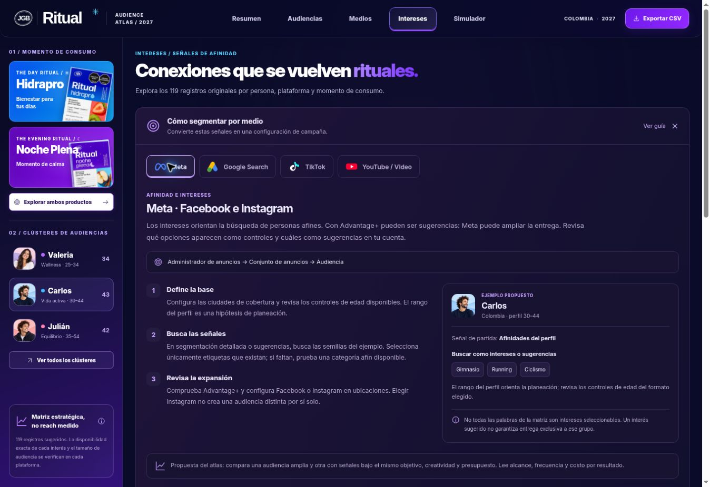
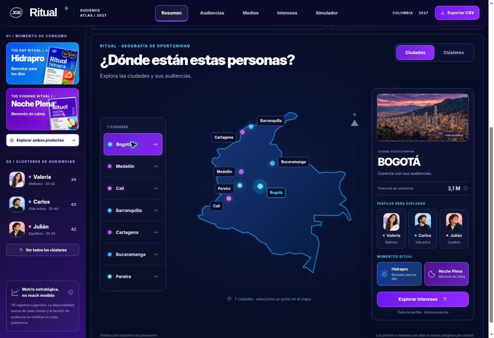

<!-- Current behavior: 2026-10-08 / 24M. Dated sections below describe historical changes. -->
# Ritual Audience Atlas 2027

Atlas estático de audiencias para Ritual Hidrapro y Noche Plena. La interfaz sigue las tres referencias entregadas el 30 de septiembre de 2026: resumen oscuro con productos y mapa, tarjetas fotográficas de medios y simulador claro de Día + Noche.

**Sitio:** https://ritual-audience-lab.vercel.app

## Funciones

- Base común de todo el atlas: personas de 18 años en adelante, sin límite superior, en toda Colombia y de todos los géneros.
- Resumen con universo supuesto y explorador nacional de clústeres por afinidad. El mapa representa la cobertura del país, con perfiles, momentos de consumo y acceso a intereses; sin filtros ni potenciales por ciudad.
- Panel lateral permanente con filtros de producto y los tres perfiles: Valeria, Carlos y Julián.
- Medios: Meta, Google, TikTok y YouTube, con porcentajes derivados de las señales de la matriz y accesos a sus intereses.
- Audiencias: perfiles completos y acceso a sus señales.
- Intereses: 119 registros originales, búsqueda sin sensibilidad a tildes, filtros combinables, categorías, tarjetas, tabla, paginación y detalle.
- Guía «Cómo segmentar por medio»: pasos, ejemplos del perfil o interés, validación, fuentes oficiales y copia del texto; disponible en Intereses, fichas y Medios.
- Simulador Día + Noche: mezcla ajustable, intersección, alcance y frecuencia en 12 olas, y exportación del escenario.
- Inversión por medio: se conserva el modelo de presupuesto/CPM, asignación total de 100%, escenarios y comparación de hasta tres planes.
- CSV contextual y persistencia local de los simuladores. Navegación por URL y menú para pantallas pequeñas.

## Datos y supuestos

`data.js` conserva las 119 filas originales y sus nueve campos: Valeria 34, Carlos 43 y Julián 42. Las fotografías, perfiles editoriales y categorías son ilustrativos. Google y YouTube comparten las mismas 34 filas; no son 68 señales diferentes. Los porcentajes de medios representan registros, no alcance publicitario.

El universo activo es **24 millones de adultos de toda Colombia**, distribuido en cinco franjas excluyentes: 18–25, 26–34, 35–44, 45–54 y 55+. Se distribuye proporcionalmente al potencial digital estimado por edad con población DANE 2027 y tasas TIC 2025. Los conteos suman exactamente 24.000.000. [Cálculo, fuentes y límites](docs/universo-2027.md).

Día y Noche comparten la misma base, presupuesto, mix y CPM. La intersección tiene un máximo configurable entre 0% y 10% de la audiencia menor alcanzada. Los alcances por producto se asignan de forma coordinada y conservan el alcance total del modelo de medios, sin sobrepasar los 24 M. La barra muestra solo Día, ambos y solo Noche de forma proporcional. Es un objetivo de planificación, no una medición de entrega.

Resumen y Audiencias presentan edades, pesos, explicaciones y una propuesta editorial por etapa. Los perfiles de afinidad se mantienen, incluyendo Alex. El directorio de droguerías conserva fuentes, registros, filtros y exportaciones. La base activa del navegador migra a 24 M y conserva inversión, CPM y mix. Las comparaciones históricas se preservan.

## Ejecutar y verificar

No necesita compilación ni dependencias de aplicación. Abre `index.html` o ejecuta:

```sh
python -m http.server 4173
node --test tests/*.test.cjs
```

Las veinte pruebas verifican redistribución, presupuesto, límites de alcance, sanitización de estados, intersección, frecuencia y las 101 combinaciones de inversión en 12 olas. Se comprobó también la navegación, filtros, detalles, tablas, exportación por producto y la conservación del simulador por medios mediante una prueba de integración de DOM.

## Archivos principales

- `index.html`: cinco vistas y diálogos.
- `ritual-2027.css`, `styles.css` y `atlas.css`: estilos de base y diseño de las nuevas referencias; reglas responsive.
- `data.js`: matriz original.
- `audience-model.js`: base demográfica, tasas de internet y fuentes.
- `model.js`: inversión por medios y migración de escenarios.
- `product-model.js`: simulación por producto y olas.
- `app.js`: interacción, gráficos SVG, exportación y persistencia.
- `segmentation.js`: guías editoriales de Meta, Google Search, TikTok y YouTube/Video.
- `docs/segmentation-guide.md`: alcance, fuentes y verificación de las guías.
- `assets/SOURCES.md`: procedencia de imágenes, tipografía y mapa.
- `docs/atlas-assets.md`: prompts de los nuevos recursos generados.

La versión B previa permanece disponible en el historial de Git. El proyecto se publica automáticamente desde `main` mediante la configuración existente de Vercel.

## Capturas de versiones anteriores


Verificación final en navegador de escritorio (1363 px): las cinco vistas, fotografías sin fallos de carga, búsqueda de Yoga con cuatro resultados, controles del simulador por producto, caso 100% Día y persistencia al recargar. Se corrigieron solapamientos de etiquetas en los gráficos y la cabecera del mapa. El diseño responsive está implementado; el entorno no permitió inspección visual con un viewport móvil.

## Corrección de filtros de Carlos · 1 de octubre de 2026

Las 43 señales originales de Carlos corresponden a Día / recuperación. Al seleccionarlo desde Noche Plena, el atlas libera el filtro de producto incompatible y muestra un aviso; conserva los otros filtros activos en la barra de Intereses. Al elegir un producto incompatible con el perfil seleccionado, da prioridad al producto y libera el perfil. Los filtros compatibles se conservan y el contador de Intereses muestra la persona y el producto activos.

Verificado en el sitio publicado: Carlos con Meta muestra 22 señales; Carlos en Medios muestra 43, distribuidas en Meta 22, TikTok 10 y Google/YouTube 11 compartidas. Seleccionar Valeria conserva Noche Plena y muestra 34 señales. No se modificó la matriz original.


## Guías por medio · 1 de octubre de 2026

Intereses incluye un panel desplegable con guías de Meta, Google Search, TikTok y YouTube/Video. Cada ficha enlaza a pasos y ejemplos del interés elegido, y Medios ofrece acceso directo. Las guías conservan el perfil activo y pueden copiarse con sus fuentes. [Alcance editorial y verificación](docs/segmentation-guide.md).



## Mapa C · Explorador de ciudades (versión anterior)

El resumen ahora muestra el mapa a todo el ancho, con selección de las siete ciudades, pestañas Ciudades / Clústeres, panel con imagen ilustrativa y acceso a perfiles, productos e intereses. [Diseño, fuentes y verificación](docs/map-explorer.md).



## Base nacional de 18+ · 7 de octubre de 2026

Todo el atlas, las guías y los CSV comparten Colombia / 18+ / todos los géneros. Los nombres de Valeria, Carlos y Julián identifican afinidades ilustrativas; no imponen filtros de género, ciudad ni edades adultas. El mapa conserva el contorno nacional y permite explorar los clústeres y productos.

La actualización de amplitud sustituye el escenario anterior de 14 M por 30 M y unifica los modelos por producto y por medios. El cálculo, las fuentes oficiales y la distinción entre universo potencial y alcance están disponibles dentro del dashboard. [Sustento del universo ampliado](docs/universo-2027.md). [Registro de la primera actualización nacional](docs/audiencia-nacional.md).
