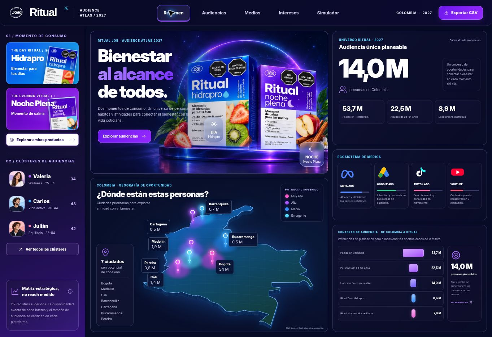
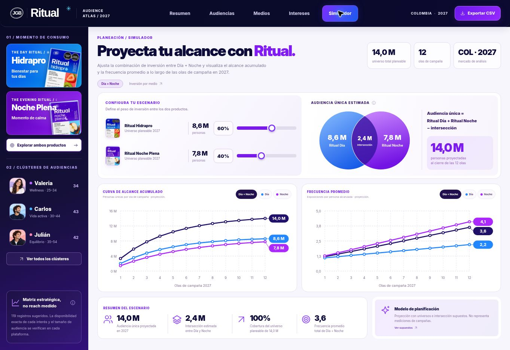
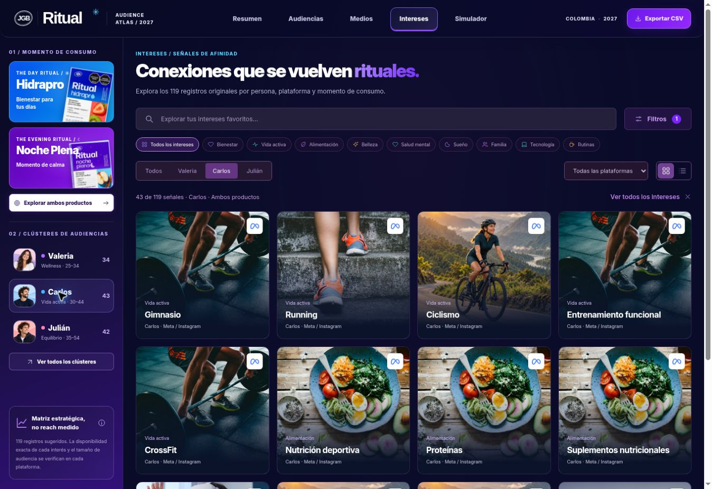

# Ritual Audience Atlas 2027

Atlas estático de audiencias para Ritual Hidrapro y Noche Plena. La interfaz sigue las tres referencias entregadas el 30 de septiembre de 2026: resumen oscuro con productos y mapa, tarjetas fotográficas de medios y simulador claro de Día + Noche.

**Sitio:** https://ritual-audience-lab.vercel.app

## Funciones

- Resumen con universo de planeación, mapa de Colombia con siete ciudades y ecosistema de medios.
- Panel lateral permanente con filtros de producto y los tres perfiles: Valeria, Carlos y Julián.
- Medios: Meta, Google, TikTok y YouTube, con porcentajes derivados de las señales de la matriz y accesos a sus intereses.
- Audiencias: perfiles completos y acceso a sus señales.
- Intereses: 119 registros originales, búsqueda sin sensibilidad a tildes, filtros combinables, categorías, tarjetas, tabla, paginación y detalle.
- Guía «Cómo segmentar por medio»: pasos, ejemplos del perfil o interés, validación, fuentes oficiales y copia del texto; disponible en Intereses, fichas y Medios.
- Simulador Día + Noche: mezcla ajustable, intersección, alcance y frecuencia en 12 olas, y exportación del escenario.
- Inversión por medio: se conserva el modelo de presupuesto/CPM, asignación total de 100%, escenarios y comparación de hasta tres planes.
- CSV contextual y persistencia local de los simuladores. Navegación por URL y menú para pantallas pequeñas.

## Datos y supuestos

`data.js` conserva las 119 filas originales y sus nueve campos: Valeria 34, Carlos 43 y Julián 42. Las fotografías, perfiles editoriales y categorías son ilustrativos. Google y YouTube comparten las mismas 34 filas; no son 68 señales diferentes. Los porcentajes de medios representan registros, no alcance publicitario.

Los valores demográficos, territoriales y universos que aparecen en la referencia visual se presentan como supuestos de planeación sin fuente demográfica verificada. El mapa utiliza un contorno geográfico de Colombia; su iluminación es decorativa. Los valores de ciudades no son mediciones de campañas ni proyecciones censales.

El nuevo modelo usa universos de 8,6 M (Día), 7,8 M (Noche) e intersección de 2,4 M. El escenario base 60/40 alcanza 14,0 M únicos al cierre de 12 olas: 100% de un universo de 14,0 M. La frecuencia combinada se calcula con las impresiones totales divididas por el alcance único (aproximadamente 3,6), no mediante un promedio simple. Cambiar los porcentajes altera las curvas de saturación; una asignación de 0% no genera alcance del producto. Los supuestos se explican en el simulador.

El modelo de inversión por medio conserva su fórmula de presupuesto, CPM y saturación, con independencia supuesta entre canales. Es un ejercicio separado del modelo por producto. Ninguno está conectado a cuentas publicitarias ni representa resultados medidos.

## Ejecutar y verificar

No necesita compilación ni dependencias de aplicación. Abre `index.html` o ejecuta:

```sh
python -m http.server 4173
node --test tests/*.test.cjs
```

Las diez pruebas verifican redistribución, presupuesto, límites de alcance, sanitización de estados, intersección, frecuencia y las 101 combinaciones de inversión en 12 olas. Se comprobó también la navegación, filtros, detalles, tablas, exportación por producto y la conservación del simulador por medios mediante una prueba de integración de DOM.

## Archivos principales

- `index.html`: cinco vistas y diálogos.
- `styles.css` y `atlas.css`: estilos de base y diseño de las nuevas referencias; reglas responsive.
- `data.js`: matriz original.
- `model.js`: inversión por medios.
- `product-model.js`: simulación por producto y olas.
- `app.js`: interacción, gráficos SVG, exportación y persistencia.
- `segmentation.js`: guías editoriales de Meta, Google Search, TikTok y YouTube/Video.
- `docs/segmentation-guide.md`: alcance, fuentes y verificación de las guías.
- `assets/SOURCES.md`: procedencia de imágenes, tipografía y mapa.
- `docs/atlas-assets.md`: prompts de los nuevos recursos generados.

La versión B previa permanece disponible en el historial de Git. El proyecto se publica automáticamente desde `main` mediante la configuración existente de Vercel.

## Vistas publicadas






Verificación final en navegador de escritorio (1363 px): las cinco vistas, fotografías sin fallos de carga, búsqueda de Yoga con cuatro resultados, controles del simulador por producto, caso 100% Día y persistencia al recargar. Se corrigieron solapamientos de etiquetas en los gráficos y la cabecera del mapa. El diseño responsive está implementado; el entorno no permitió inspección visual con un viewport móvil.

## Corrección de filtros de Carlos · 1 de octubre de 2026

Las 43 señales originales de Carlos corresponden a Día / recuperación. Al seleccionarlo desde Noche Plena, el atlas libera el filtro de producto incompatible y muestra un aviso; conserva los otros filtros activos en la barra de Intereses. Al elegir un producto incompatible con el perfil seleccionado, da prioridad al producto y libera el perfil. Los filtros compatibles se conservan y el contador de Intereses muestra la persona y el producto activos.

Verificado en el sitio publicado: Carlos con Meta muestra 22 señales; Carlos en Medios muestra 43, distribuidas en Meta 22, TikTok 10 y Google/YouTube 11 compartidas. Seleccionar Valeria conserva Noche Plena y muestra 34 señales. No se modificó la matriz original.


