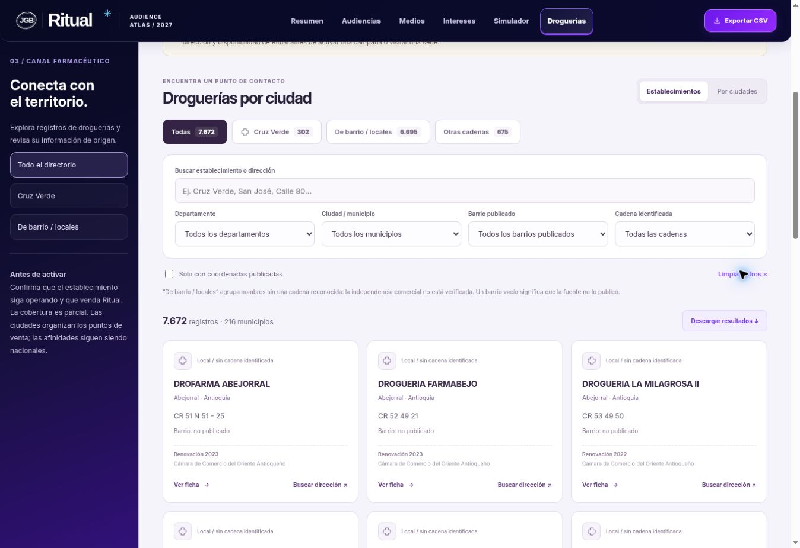

# Verificación · audiencia 18–25 y directorio de droguerías

Versión funcional publicada: `a62c1f44548a2f4d191f609f7ca150cf2377d12f`.

Historia verificada: navegación del atlas → nuevo perfil o directorio → datos de edad/fuentes → filtros y fichas → descarga con las mismas condiciones.

- 18 pruebas automáticas pasan: modelos originales, integridad y trazabilidad del directorio, búsqueda con tildes, filtros combinados, agregación por municipio, exportación completa y edad de Alex.
- Producción: abre Droguerías y carga 7.672 registros desde el JSON publicado. El catálogo muestra 302 Cruz Verde, 216 municipios y 27 departamentos contando Bogotá D.C., con cobertura parcial visible.
- Bogotá + Cruz Verde devuelve 117 registros. Con coordenadas publicadas, devuelve 63; el CSV descargado contiene exactamente esos 63 con coordenadas, fuente, fecha y cobertura parcial.
- El enlace de mapa de la ficha probada usa las coordenadas publicadas 4.638605,-74.063984. Los registros sin coordenadas generan búsqueda por texto de dirección, sin asignar ubicación ficticia.
- Amazonas muestra ausencia de registros integrados, sin afirmar que no existan droguerías allí.
- La versión final consolida Yopal en una sola opción: 190 registros. La vista por ciudades se comprobó; los indicadores se calculan sobre los filtros activos.
- Alex: perfil detallado, 24 señales, 8 por grupo de medio. La guía Google advierte rangos 18–24 y 25–34 y la imposibilidad de aislar 25 con esos intervalos.
- CSV de Alex descargado y leído: 24 filas, perfil Alex, edad 18–25 en todas. Se conservan las 119 señales previas: 143 totales.
- Mapa del resumen con Alex: título, etiqueta y detalle muestran 18–25, dentro de la base adulta; el universo del simulador conserva 30 M.
- No aparecieron errores del dominio de la aplicación en los registros del navegador revisados. Se observaron avisos de una extensión del navegador, ajenos al sitio.

Revisión visual en la ventana de escritorio disponible. El CSS incluye adaptación móvil; no se hizo una comprobación visual en un dispositivo móvil.

## Capturas

## Límite pendiente

La interfaz está implementada y publicada. **La cobertura de datos no es exhaustiva.** Para acreditar todas las sedes vigentes se necesita un maestro actual de Cruz Verde y un censo nacional o bases territoriales adicionales conciliadas. Los registros tienen distintas fechas, varios históricos; no garantizan operación, inventario ni venta de Ritual. Este límite aparece en portada, fuentes, fichas y exportaciones.
