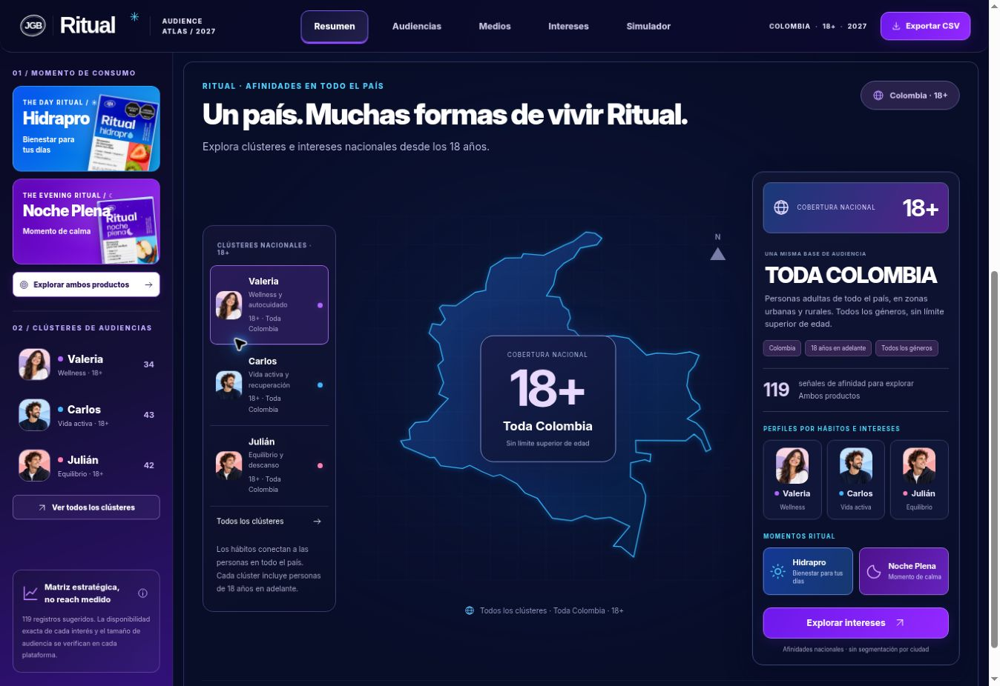
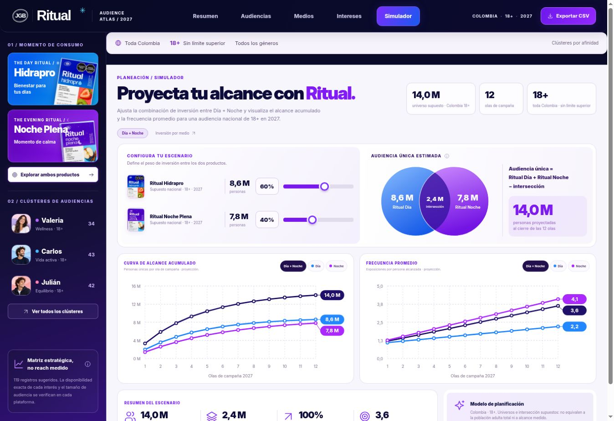

# Ritual · Audiencia nacional de 18 años en adelante

Actualización: 7 de octubre de 2026.

## Base de activación

- Toda Colombia, incluidas zonas urbanas y rurales.
- Edad mínima de 18 años, sin límite superior.
- Todos los géneros.
- Valeria, Carlos y Julián representan hábitos y afinidades. Sus nombres y retratos no restringen género, ciudad ni edades adultas.

El resumen sustituye las siete ciudades y sus potenciales ilustrativos por una vista nacional con selección de clústeres. La biblioteca mantiene las 119 señales originales, sus productos y plataformas. El campo original `territory` describe afinidades, no geografía; la interfaz y el CSV ahora lo llaman «Afinidad».

Las guías de Meta, Google Search, TikTok y YouTube incluyen la misma base nacional. El texto copiado y las cuatro modalidades de CSV incluyen cobertura, edad y género.

## Universo del simulador · registro de la primera versión

Esta sección documenta la versión inicial. Fue sustituida por la [ampliación sustentada a 30 M](universo-2027.md), que comparte el modelo de presupuesto entre ambas pestañas.

Se conservan como supuestos: Día 8,6 M; Noche 7,8 M; intersección 2,4 M; universo único 14,0 M. No representan la población adulta total del país ni una medición de plataformas. Ampliar edad y ubicación de activación no produce una nueva estimación demográfica. El 100% de cobertura del escenario corresponde al universo supuesto de 14 M.

Se retiraron del resumen las cifras demográficas y urbanas no verificadas. La inversión por medio sigue admitiendo un universo editable. Los dos modelos mantienen sus fórmulas y se presentan como ejercicios separados.

## Verificación antes de publicar

- Diez pruebas existentes de modelos aprobadas: inversión, redistribución, saturación, frecuencias e intersección.
- Integración de DOM: tres clústeres de 18+, cobertura nacional en todas las vistas, ausencia de selectores por ciudad, 119 registros originales.
- Las cuatro guías mantienen el perfil activo e incluyen la base nacional en el texto copiado.
- Exportaciones de Intereses, Medios, Día + Noche e inversión por medio con el contexto de audiencia. Carlos conserva sus 43 señales.
- Casos de inversión 100% Día, 100% Noche y mezcla 60/40; presupuesto cero por medios.
- Compatibilidad de filtros: seleccionar Carlos desde Noche libera el filtro de producto incompatible.
- Sin errores de ejecución en la integración. Revisión de sintaxis JavaScript y `git diff --check` aprobadas.

Fuentes de apoyo para las guías: [segmentación demográfica de Google Ads](https://support.google.com/google-ads/answer/2580383?hl=en) y [segmentación de TikTok](https://ads.tiktok.com/resources/help/article/ad-targeting?lang=en), consultadas el 7 de octubre de 2026. La disponibilidad de opciones se valida en cada cuenta y formato; el atlas no modifica campañas publicitarias.

## Verificación en producción

Publicado desde `main` en el proyecto Vercel `ritual-audience-lab`, commit de implementación `9c5935c`. El estado de despliegue de Vercel confirmó finalización correcta.

En el sitio público, a 1363 px: barra Colombia / 18+ / todos los géneros, tres perfiles adultos, selector nacional de Carlos con 43 señales, navegación desde el mapa hasta Intereses y guía Meta con cobertura nacional. El control Día pasó de 60% a 61%, Noche respondió con 39% y se restauró 60/40. Imágenes visibles cargadas y sin desbordamiento horizontal del simulador. No se registraron errores de la aplicación en los mensajes de consola filtrados por su dominio. La vista móvil no se comprobó visualmente en este entorno.

